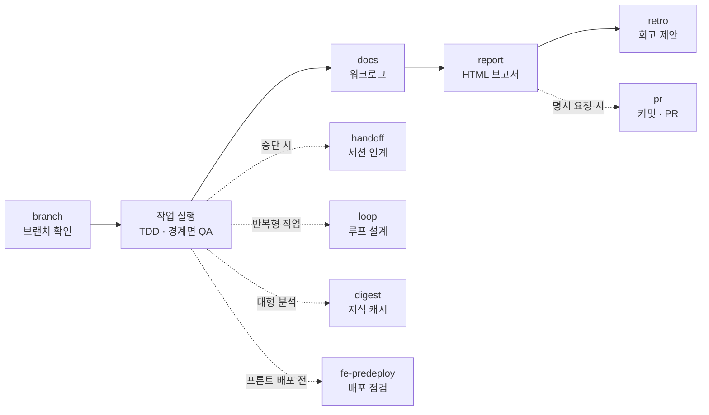

# guksu-harness

> 도메인 요청을 **에이전트(누가) · 스킬(어떻게) · 오케스트레이션(언제, 어떤 순서로)**의 세 층으로 분해해, 프로젝트에 맞는 자동화 하네스를 구축·운영·진화시키는 Claude Code 메타 스킬 플러그인.

"이 프로젝트에 하네스 구축해줘" 한 문장이면 **감사 → 설계 → 구축 → 검증 → 등록**의 5단계를 거쳐 에이전트 정의·오케스트레이터·안전 훅·기록 템플릿이 프로젝트에 생성된다. 이후의 모든 작업은 **브랜치 확인 → 실행 → 기록 → 보고 → 회고**의 일관된 사이클로 돌아가고, 위험한 동작(git 변경·시크릿 접근·보호 브랜치 편집)은 지침이 아니라 훅이 기계적으로 차단한다.

## 설치

```
/plugin marketplace add Guksu/guksu-harness
/plugin install guksu-harness@guksu-harness
```

## 빠른 시작

| 하고 싶은 것 | 이렇게 입력 |
|---|---|
| 프로젝트에 하네스 구축 | `/guksu-harness:harness 이 프로젝트에 하네스 구축해줘` |
| 하네스 점검·동기화 | `/guksu-harness:harness 점검` |
| 에이전트·스킬 추가 | `/guksu-harness:harness QA 에이전트 추가` |
| 작업 기록 남기기 | `/guksu-harness:docs 오늘 작업 기록해줘` |
| 작업 결과 보고서 | `/guksu-harness:report 이번 작업 보고서 만들어줘` |
| 프론트 배포 전 점검 | `/guksu-harness:fe-predeploy 배포 전 점검 돌려줘` |
| 테스트 통과까지 반복 | `/guksu-harness:loop 테스트 전부 통과할 때까지 고쳐줘` |
| 세션 넘기기 / 이어받기 | `/guksu-harness:handoff 인계 문서 작성해줘` |
| 커밋하고 PR 올리기 | `/guksu-harness:pr 커밋하고 PR 올려줘` |

슬래시 명령어가 확실하지만, 자연어("하네스 점검해줘", "브랜치 파줘", "어디까지 했었지")로도 description 매칭으로 트리거된다. 이름이 겹치지 않으면 `/harness ...`처럼 줄여 써도 된다.

## 어떻게 돌아가는가

### 세 층 구조

| 층 | 담는 것 | 산출물 위치 |
|---|---|---|
| **스킬** | 어떻게 — 작업 절차 | `프로젝트/.claude/skills/` |
| **에이전트** | 누가 — 역할·전문성·협업 프로토콜 | `프로젝트/.claude/agents/` |
| **오케스트레이터** | 언제, 어떤 순서로 — 흐름·데이터 전달·에러 핸들링 | 스킬의 특수형 (`{domain}-orchestrator`) |

한 파일에 섞이면 재사용이 죽기 때문에 항상 분리해서 생성한다.

### 하네스 구축 5 Phase

| Phase | 이름 | 하는 일 |
|---|---|---|
| 0 | 현황 감사 | 기존 에이전트·스킬·CLAUDE.md 확인 + `validateHarness.mjs` 실행 → 신규 구축 / 확장 / 유지보수 / 해체 분기 결정 |
| 1 | 설계 | 도메인 분석 → 실행 모드 선택(아래 사다리) → 에이전트 분리 판단(전문성·병렬성·컨텍스트·재사용성 4축) |
| 2 | 구축 | 에이전트 정의·스킬·오케스트레이터 생성 + 훅·권한 구성 + 공통 템플릿 6종 배포 |
| 3 | 검증 | 구조(validateHarness) · 트리거(near-miss 쿼리) · 실행 테스트 + 컨텍스트 경제 점검 |
| 4 | 등록·진화 | CLAUDE.md 포인터 + 변경 이력 등록, 실행 피드백을 정의에 반영(retro) |

### 실행 모드 — 단일 우선 에스컬레이션 사다리

멀티에이전트는 기본값이 아니다(채팅 대비 ~15배 토큰). 가장 싼 모드에서 시작해, 더 싼 모드로 안 되는 **근거**가 있을 때만 한 칸 올라간다:

```
0. 직접 실행          — 대부분의 작업. 오케스트레이션 자체가 불필요
1. 서브 에이전트 1개   — 컨텍스트 격리·단일 전문성이 필요한 단발 위임
2. 루프               — 종료를 기계적으로 검증하며 반복 수렴할 때 (loop 스킬)
3. Workflow           — 흐름을 코드로 쓸 수 있고 항목이 많을 때 (결정적 팬아웃·파이프라인)
4. 에이전트 팀 (최후)  — 진행 중 협상·재작업(기획↔구현↔QA)이 본질일 때만
```

### 절대 규칙 7종 — 생성되는 모든 하네스에 내장

1. **git 작업은 사용자 전담** — 예외는 2종뿐: ① 사용자 확인된 브랜치 전환(`branch` 스킬), ② 사용자가 명시 요청한 커밋·PR 업로드(`pr` 스킬)
2. **코드 생성 하네스는 TDD 기본** — 인수조건 = 테스트 케이스, 종료 기준에 전체 통과 포함
3. **산출물은 파일 기반** — 약속된 경로에 쓰고 읽고, 중간 산출물은 보존(감사 추적)
4. **단일 출처 문서 준수** — 설계·컨벤션 문서와 어긋나면 사용자에게 확인
5. **QA는 경계면 교차검증 + incremental** — 생산자↔소비자 shape 비교, 모듈 완성 직후마다
6. **시크릿 읽기·기록 금지** — `.env`·credential을 읽지 않고 산출물에 옮겨 적지 않는다
7. **컨텍스트 절약형 설계** — 상시 로딩은 포인터 수준, 대량 읽기는 서브 에이전트 격리, 플랫폼이 자동으로 하는 것은 재구현 금지

### 지침이 아니라 기계적 강제 — 훅 4종

규칙 1·6과 브랜치 위생은 `assets/hooks/`의 실물 훅이 생성되는 하네스의 `.claude/hooks/`로 복사되어 강제한다. **훅이 그물, 스킬이 절차다.**

| 훅 | 발동 시점 | 막는 것 |
|---|---|---|
| `blockGitMutation` | Bash 실행 전 | git 변경 명령 전부. 읽기(status·diff·log)와 사용자 승인 switch만 통과. `allowCommitPush` 옵트인 시 commit·push가 열리되 Claude 작성 표기 커밋·force push·히스토리 재작성은 계속 차단 |
| `blockSecretAccess` | Bash 실행 전 | `cat .env` 같은 Bash 경유 시크릿 읽기 — permissions deny(Read 도구 측)와 2중 방어 |
| `branchGuard` | Edit·Write·NotebookEdit 전 | 보호 브랜치(기본 main·master, config로 조정) 위 파일 편집 → `branch` 스킬로 확인받으라고 피드백 |
| `verifierGate` (선택) | 턴 종료(Stop) | 검증 명령(테스트·타입체크 등) 실패 상태의 턴 종료를 차단. 안전장치(`maxTokens`·`maxIterations`·`stuckAfter`) 도달 시엔 반대로 "보고 후 종료"를 지시 |

## 스킬 10종

| 스킬 | 한 줄 요약 |
|---|---|
| `harness` | 하네스 구축·점검·확장·해체를 담당하는 메타 스킬 (5 Phase) |
| `branch` | 작업 시작 전 브랜치 확인 — 보호 브랜치면 사용자 승인 후 `git switch` |
| `docs` | 모든 작업을 공통 워크로그 템플릿으로 기록 |
| `digest` | 대형 파일·모듈 분석 결과를 세션 간 지식 캐시로 저장 |
| `loop` | 반복·수렴형 작업을 루프 명세로 설계하고 안전장치와 함께 실행 |
| `handoff` | 진행 중 작업을 인계 문서로 옮겨 세션 경계를 넘긴다 |
| `report` | 작업 종료 시 HTML 보고서 생성 — 채팅에는 요약만 |
| `fe-predeploy` | 프론트엔드 배포 전 점검 — 정적 게이트·브라우저 계측·성능 측정으로 배포 가능 판정 |
| `retro` | 산출물 근거 회고로 하네스 정의를 개선 (제안→승인→적용) |
| `pr` | 사용자가 명시 요청한 경우에만 커밋·push·PR 생성 |

### harness — 하네스 아키텍트

- `/harness 구축·점검·추가·해체` 인자로 Phase 0 분기를 선결정, 어떤 경우든 감사부터 시작한다
- 실행 모드는 사다리로 판별하고, 모델은 하드코딩하지 않는다(세션 상속) — 모델 세대가 바뀌어도 하네스가 늙지 않는다
- `validateHarness.mjs`가 frontmatter·참조 링크·훅/템플릿 구성·버전 정합성을 자동 검사한다 (회귀 테스트 66종)

### branch — 작업 브랜치 확인

- 보호 브랜치 위에서 시작된 작업은 커밋 시점에야 발견된다 — 이 스킬은 **작업 시작 시점**에 예방한다
- 이름은 제안(기존 패턴 우선, git-flow면 `feat/{slug}`를 dev에서 분기), 결정은 사용자. 수단은 `git switch(-c)`뿐
- 파괴·이탈 플래그(`-f`·`--discard-changes`·`-C`·`--orphan`·`-d`)와 `checkout`·`restore`·`clean`은 훅이 차단

### docs — 공통 워크로그

- 템플릿은 **1. 개요 / 2. 작업내용 / 3. 주의사항** — 형식이 통일되어야 에이전트 간·세션 간에 기록을 소비할 수 있다
- 기록 위치 `docs/worklog/{YYYY-MM-DD}-{slug}.md`, 병렬 에이전트는 `-{agent}` 접미사로 각자 파일
- 템플릿 6종(worklog·retro·handoff·loop-spec·digest·report.html)을 번들하고 하네스 구축 시 프로젝트로 배포

### digest — 세션 간 지식 캐시

- 프롬프트 캐시는 세션 안에서만 산다 — 분석 요약을 `docs/digests/{slug}.md`로 남겨 다음 세션이 원문 대신 소비
- 신선도는 **내용 해시**로 판정(`checkFreshness.mjs`) — fresh면 다이제스트만, stale이면 바뀐 소스만 재읽기
- 다이제스트는 지도이지 원문 대체가 아니다 — 수정할 파일은 반드시 원문을 읽는다

### loop — 루프 설계

- 자기평가 금지 — 종료 판정은 기계적 검증(명령 종료 코드)만. 검증 불가 목표는 루프로 만들지 않는다
- 4요소(트리거·실행 단위·검증자·종료 규칙)는 **사용자 확인 필수**, 명세는 `docs/loops/`에 기록
- 안전장치 필수 — 최대 반복·토큰 예산·막힘 판정. 초과 시 자동 중단하고 보고 후 종료
- 실행 수단: 검증자 게이트(조건 충족까지) · `/loop`(주기·자율 페이스) · Workflow 반복 · 예약 실행

### handoff — 세션 인계

- 독자는 이 대화를 전혀 보지 못한 새 세션이다 — 대화 맥락 없이 읽혀야 인계다
- 작업 흐름당 1개 갱신형 문서(`docs/handoff/{slug}.md`), "시도와 결과"는 누적 기록(막다른 길 반복 방지)
- 세션 안의 컨텍스트 연속은 플랫폼이 자동 보장한다 — 이 스킬의 초점은 **세션 경계**(다음 세션·다른 담당자)

### report — 작업 종료 HTML 보고서

- 채팅 보고는 스크롤에 묻힌다 — `docs/reports/{YYYY-MM-DD}-{slug}.html`로 누적해 히스토리로 만든다
- 5개 고정 섹션: 요약 / 작업 내용 / 검증 결과 / **사용자 검토 필요** / **후속 조치**. 채팅에는 3~5문장 요약만
- 워크로그(md)가 정본, 보고서는 검토용 뷰 — slug를 맞춰 쌍으로 추적한다

### fe-predeploy — 프론트엔드 배포 전 점검

- "본 것 같다"가 아니라 **측정** — 버튼 5연타 → POST 요청 1건, 마운트 5사이클 → 리스너 순증가 0처럼 숫자로 판정 (퓨어 JS·React·Next.js)
- 4단계: 정적 게이트(빌드·린트·테스트·정적 스캔) → 브라우저 런타임 계측(claude-in-chrome — 중복 클릭·메모리 누수·네트워크 경계) → 성능(Core Web Vitals, lighthouse) → 시각·UX 스윕(뷰포트 3종·접근성)
- 번들 스크립트: `staticScan.mjs`(클린업 누락·debugger·시크릿 리터럴 휴리스틱), `instrument.js`(리스너·타이머·요청 카운터 주입)
- 판정은 pass/fail/skip 3분류(skip 사유 필수), blocker fail 있으면 "배포 불가" — 결과는 `docs/predeploy/` 체크리스트로 누적, 기준치는 config로 조정
- 점검과 수정을 분리한다 — 수정은 제안까지, "통과까지 고쳐줘"는 loop 스킬과 결합

### retro — 회고 기반 진화

- 기억이 아니라 파일이 근거다 — 워크로그·qa-report·이전 회고에서 잘된 점과 반복 문제를 추출
- 증상→수정 대상 매핑: 품질 문제→스킬, 역할 혼선→에이전트 정의, 순서 문제→오케스트레이터, 트리거 누락→description
- 자동 적용 금지 — 사용자가 승인한 항목만 적용하고 validateHarness로 재검증

### pr — 커밋·PR 업로드

- **명시 요청 없이는 발동하지 않는다** — 작업이 끝났다고 알아서 커밋하지 않는다
- git-flow(main ← dev ← feat): 작업은 `feat/{slug}`, PR 베이스는 `dev`, 머지·릴리스는 사용자 전담
- 커밋 메시지·PR 본문에 Claude 작성 표기 절대 금지 — 훅이 표기 든 커밋을 기계적으로 차단
- Conventional Commits + `-m` 인라인 메시지만, 스테이징은 `git add .`가 아니라 경로 명시

## 하나의 작업 사이클

스킬들은 따로 노는 게 아니라 하나의 사이클로 맞물린다:



1. **시작** — 파일 변경 전에 `branch`가 브랜치를 확인받는다 (보호 브랜치 편집은 branchGuard가 차단)
2. **실행** — 오케스트레이터가 선택된 실행 모드로 진행. 코드 생성은 TDD, 모듈 완성 직후마다 경계면 QA
3. **기록** — 작업한 에이전트가 `docs` 워크로그를 남기고, 종료 시 `report`가 HTML 보고서를 생성 (채팅엔 요약만)
4. **진화** — 종료 시 `retro`를 제안(강요하지 않음), 승인된 개선안만 하네스 정의에 반영
5. **예외 경로** — 세션을 넘길 땐 `handoff`, "될 때까지" 작업은 `loop`, 프론트엔드 배포 앞에선 `fe-predeploy` 게이트, 커밋·PR은 사용자가 요청할 때만 `pr`

## 하네스 구축 시 프로젝트에 생성되는 것

```
프로젝트/
├── .claude/
│   ├── agents/{planner,developer,qa,...}.md   # 에이전트 정의 (빌트인 타입이라도 파일로)
│   ├── skills/{domain}-orchestrator/          # 오케스트레이터 (실행 모드·데이터 흐름·에러 핸들링)
│   ├── hooks/                                 # 훅 4종 + config (git·시크릿·브랜치·검증자 게이트)
│   ├── workflows/{name}.mjs                   # (Workflow 모드) 저장 워크플로우
│   └── settings.json                          # 훅 등록 + deny/allowlist (기존 설정과 병합)
├── docs/
│   ├── templates/                             # 공통 템플릿 6종 (프로젝트 사본이 단일 출처)
│   ├── worklog/   reports/   retro/           # 기록 (누적, 삭제하지 않음 — 감사 추적)
│   └── handoff/   digests/   loops/           # 인계 · 지식 캐시 · 루프 명세
└── CLAUDE.md                                  # 하네스 포인터(트리거 규칙) + 변경 이력 (~200줄 이내)
```

## 저장소 구조

```
guksu-harness/
├── .claude-plugin/                  # 플러그인 매니페스트 (marketplace.json · plugin.json)
└── skills/
    ├── harness/                     # 메타 스킬 — 핵심 워크플로우
    │   ├── SKILL.md
    │   ├── references/              # 실행 모드 · 에이전트 설계 · 스킬 작성 · 오케스트레이터
    │   │                            #   · 훅/권한 · 컨텍스트 경제 · 테스트 가이드 (7종)
    │   ├── assets/hooks/            # 훅 실물 4종 (프로젝트로 복사됨)
    │   └── scripts/                 # validateHarness + 회귀 테스트
    ├── docs/                        # 워크로그 스킬 + 템플릿 번들 (공통 6종 + predeploy)
    ├── fe-predeploy/                # 프론트 배포 전 점검 (references 5종 + 계측·스캔 스크립트)
    ├── branch/ pr/ loop/ digest/    # 독립 스킬들 (각 SKILL.md)
    └── handoff/ report/ retro/
```

## 개발

```bash
# 검증기 + 훅 + 다이제스트 신선도 + 배포 전 점검 회귀 테스트 (66종)
node --test skills/harness/scripts/validateHarness.test.mjs skills/harness/scripts/hooks.test.mjs skills/digest/scripts/checkFreshness.test.mjs skills/fe-predeploy/scripts/staticScan.test.mjs skills/fe-predeploy/scripts/instrument.test.mjs

# 이 repo 자체를 검증 (셀프 호스팅 — 하네스가 자기 규칙을 통과해야 한다)
node skills/harness/scripts/validateHarness.mjs .
```

## License

MIT © Guksu
