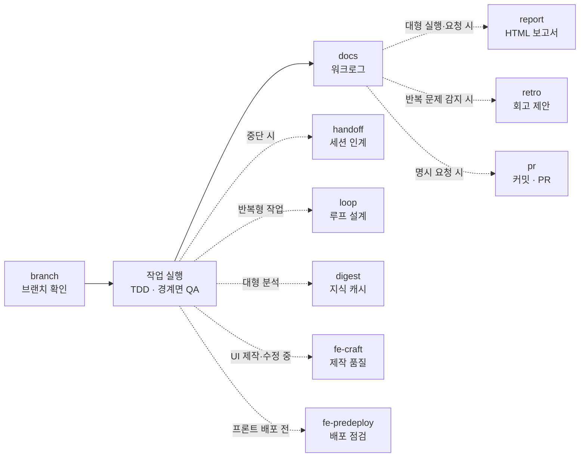

# guksu-harness

> Claude Code에게 **"이 프로젝트에 하네스 구축해줘"** 한 문장만 말하면, 그 프로젝트 전용 작업 체계(역할 분담 · 작업 절차 · 안전장치 · 기록 양식)를 자동으로 만들어 주는 Claude Code 플러그인입니다.

현재 버전 **v1.16.0** · 스킬 11종 · 안전 훅 4종 · 회귀 테스트 75종 · MIT

---

## 목차

- [1. 이게 뭔가요? (처음 오신 분)](#1-이게-뭔가요-처음-오신-분)
- [2. 용어 사전 — 이 문서를 읽기 위한 최소 단어](#2-용어-사전--이-문서를-읽기-위한-최소-단어)
- [3. 설치](#3-설치)
- [4. 5분 안에 첫 실행 해보기](#4-5분-안에-첫-실행-해보기)
- [5. 스킬 11종 — 무엇을 언제 쓰나](#5-스킬-11종--무엇을-언제-쓰나)
- [6. 하나의 작업 사이클](#6-하나의-작업-사이클)
- [7. 안전장치 — 지침이 아니라 기계적 차단](#7-안전장치--지침이-아니라-기계적-차단)
- [8. 설계 원리 (더 깊이 알고 싶다면)](#8-설계-원리-더-깊이-알고-싶다면)
- [9. 하네스를 구축하면 프로젝트에 생기는 것](#9-하네스를-구축하면-프로젝트에-생기는-것)
- [10. 자주 묻는 질문](#10-자주-묻는-질문)
- [11. 문제 해결](#11-문제-해결)
- [12. 저장소 구조와 개발](#12-저장소-구조와-개발)

---

## 1. 이게 뭔가요? (처음 오신 분)

### 해결하려는 문제

Claude Code에게 개발 작업을 시키다 보면 매번 같은 말을 반복하게 됩니다.

- "먼저 브랜치부터 파고 시작해줘" (안 그러면 main에 바로 커밋됨)
- "테스트 먼저 쓰고 구현해줘"
- "작업 끝나면 뭐 했는지 문서로 남겨줘"
- "임의로 커밋하지 마, 내가 할게"
- ".env 파일은 읽지 마"

이 말들을 매번 다시 하지 않아도 되게, **프로젝트에 상주하는 규칙과 절차로 심어 두는 것**이 이 플러그인이 하는 일입니다.

### "하네스(harness)"라는 이름

하네스는 원래 **마구(馬具)** — 말에 씌워 힘을 원하는 방향으로 쓰게 만드는 장비입니다. 말을 느리게 만드는 게 아니라, 힘이 엉뚱한 데로 새지 않게 잡아주는 물건이죠. 여기서도 같은 뜻입니다. AI의 능력을 제한하는 게 아니라 **일하는 방식을 프로젝트에 맞게 정렬**시킵니다.

### 무엇을 만들어 주나

`/guksu-harness:harness 이 프로젝트에 하네스 구축해줘` 라고 입력하면, Claude가 프로젝트를 살펴본 뒤 다음을 만들어 줍니다.

| 만들어지는 것 | 쉽게 말하면 | 저장 위치 |
|---|---|---|
| **에이전트 정의** | "누가" — 기획자·개발자·QA 같은 역할별 작업 지침서 | `.claude/agents/` |
| **스킬** | "어떻게" — 특정 작업의 단계별 절차서 | `.claude/skills/` |
| **오케스트레이터** | "언제, 어떤 순서로" — 역할 간 진행 순서와 데이터 전달 규칙 | `.claude/skills/{도메인}-orchestrator/` |
| **훅(hook)** | 위험한 명령을 실제로 막는 자바스크립트 차단기 | `.claude/hooks/` |
| **문서 템플릿** | 작업 기록·보고서·인계 문서의 공통 양식 | `docs/templates/` |

이후 그 프로젝트에서 하는 모든 작업은 **브랜치 확인 → 작업 실행 → 기록 → 보고 → 회고**라는 일정한 사이클로 돌아갑니다.

### 핵심 특징 하나만 고르라면: 훅

대부분의 "AI 규칙"은 프롬프트에 적어 두는 부탁입니다. 부탁은 지켜질 때도 있고 안 지켜질 때도 있습니다. 이 플러그인은 **가장 위험한 3가지(git 변경 · 시크릿 읽기 · 보호 브랜치 편집)를 훅이라는 실제 프로그램으로 차단**합니다. Claude가 `git commit`을 시도하면, 잘 지키려고 노력하는 게 아니라 명령 자체가 실행 전에 거부됩니다.

> **훅이 그물, 스킬이 절차다.** — 절차는 잘 하기 위한 것, 그물은 사고를 막기 위한 것입니다.

---

## 2. 용어 사전 — 이 문서를 읽기 위한 최소 단어

| 용어 | 뜻 | 비유 |
|---|---|---|
| **스킬 (Skill)** | 특정 작업의 절차를 적어 둔 마크다운 문서. Claude가 필요할 때 읽고 그대로 따릅니다 | 업무 매뉴얼 |
| **에이전트 (Agent)** | 특정 역할을 맡아 독립적으로 일하는 Claude 인스턴스. 자기만의 대화 맥락을 가집니다 | 담당자 |
| **오케스트레이터** | 여러 에이전트의 실행 순서·데이터 전달·실패 처리를 정의한 특수한 스킬 | 진행표(공정도) |
| **훅 (Hook)** | 도구 실행 직전/직후에 자동으로 끼어들어 검사하고 차단하는 스크립트 | 보안 검색대 |
| **컨텍스트 (Context)** | Claude가 한 번에 기억할 수 있는 대화·파일의 총량. 유한한 자원입니다 | 책상 크기 |
| **토큰 (Token)** | 컨텍스트와 비용의 계산 단위. 대략 한글 1자 ≈ 1~2 토큰 | 사용량 미터기 |
| **워크로그 (worklog)** | 무엇을 왜 어떻게 했는지 남기는 작업 기록 문서 | 업무 일지 |
| **다이제스트 (digest)** | 큰 코드를 분석한 요약본. 다음 세션이 원문 대신 읽습니다 | 요약 노트 |
| **보호 브랜치** | 직접 편집하면 안 되는 브랜치 (기본값: `main`, `master`) | 출입 통제 구역 |
| **Workflow** | 여러 에이전트의 실행 흐름을 자바스크립트 코드로 짜서 돌리는 실행 방식 | 자동화 스크립트 |

---

## 3. 설치

### 준비물

- **Claude Code** (CLI · 데스크톱 앱 · 웹 · IDE 확장 중 아무거나)
- **Node.js** — 훅과 검증 스크립트가 Node로 동작합니다 (`node -v`로 확인)
- **git 저장소** — 브랜치 관련 기능을 쓰려면 필요합니다
- (선택) **Claude in Chrome 확장** — `fe-predeploy`의 실제 브라우저 계측 단계에서만 사용

### 설치 명령

Claude Code 안에서 아래 두 줄을 차례로 입력합니다.

```
/plugin marketplace add Guksu/guksu-harness
/plugin install guksu-harness@guksu-harness
```

- 첫 줄: 이 저장소를 플러그인 마켓플레이스로 등록합니다
- 둘째 줄: 등록된 마켓플레이스에서 플러그인을 설치합니다

### 설치 확인

`/plugin` 을 입력해 `guksu-harness`가 목록에 보이면 성공입니다. 또는 `/guksu-harness:` 까지만 입력하면 스킬 11종이 자동완성으로 뜹니다.

---

## 4. 5분 안에 첫 실행 해보기

### 4-1. 어떻게 부르나 — 세 가지 방법

| 방법 | 예시 | 언제 |
|---|---|---|
| **전체 이름** | `/guksu-harness:harness 하네스 구축해줘` | 항상 확실하게 동작 |
| **짧은 이름** | `/harness 하네스 구축해줘` | 다른 플러그인과 이름이 겹치지 않을 때 |
| **자연어** | "이 프로젝트 하네스 좀 구축해줘" | 각 스킬의 description이 요청과 매칭되면 자동 발동 |

세 방법 모두 같은 스킬을 실행합니다. 처음이라면 **전체 이름**을 권합니다 — 의도한 스킬이 확실히 뜨는지 눈으로 확인할 수 있습니다.

### 4-2. 하고 싶은 것별 입력 문장

| 하고 싶은 것 | 이렇게 입력 |
|---|---|
| 프로젝트에 하네스 구축 | `/guksu-harness:harness 이 프로젝트에 하네스 구축해줘` |
| 하네스 상태 점검·동기화 | `/guksu-harness:harness 점검` |
| 에이전트·스킬 추가 | `/guksu-harness:harness QA 에이전트 추가` |
| 작업 기록 남기기 | `/guksu-harness:docs 오늘 작업 기록해줘` |
| 결과 보고서 만들기 | `/guksu-harness:report 이번 작업 보고서 만들어줘` |
| 프론트엔드 배포 전 점검 | `/guksu-harness:fe-predeploy 배포 전 점검 돌려줘` |
| UI 다듬기 · 모션 리뷰 | `/guksu-harness:fe-craft 이 화면 디자인 비평해줘` |
| 조건 만족까지 반복 작업 | `/guksu-harness:loop 테스트 전부 통과할 때까지 고쳐줘` |
| 세션 넘기기 / 이어받기 | `/guksu-harness:handoff 인계 문서 작성해줘` |
| 커밋하고 PR 올리기 | `/guksu-harness:pr 커밋하고 PR 올려줘` |

### 4-3. 첫 하네스 구축, 단계별로 무슨 일이 일어나나

`/guksu-harness:harness 이 프로젝트에 하네스 구축해줘` 를 입력하면 Claude가 **5단계(Phase 0~4)** 를 밟습니다.

| 단계 | 이름 | Claude가 하는 일 | 사용자가 할 일 |
|---|---|---|---|
| **0** | 현황 감사 | 기존 에이전트·스킬·CLAUDE.md를 읽고 `validateHarness.mjs`로 구조를 검사한 뒤, 신규 구축 / 확장 / 유지보수 / 해체 중 어디에 해당하는지 판단 | 보고된 계획을 확인 |
| **1** | 설계 | 프로젝트 도메인을 분석하고, 실행 모드(§8-2 사다리)와 **티어(라이트/풀)** 를 고르고, 풀 티어면 에이전트를 몇 개로 나눌지 판단 | **역할 분리안·실행 모드에 동의 여부 답변** |
| **2** | 구축 | 티어에 맞는 산출물 생성 — 라이트: 도메인 스킬 + 훅·권한 + 규칙 파일 + 템플릿 2종 / 풀: 에이전트 정의·오케스트레이터·템플릿 6종까지 | 보호 브랜치 목록·커밋 권한 옵트인 등 **확인 질문에 응답** |
| **3** | 검증 | `validateHarness.mjs` 재실행(구조), 비슷한 요청으로 트리거 테스트, 컨텍스트 낭비 점검 | 결과 확인 |
| **4** | 등록·진화 | `CLAUDE.md`에 하네스 포인터와 변경 이력 기록 | — |

**중간에 질문을 받습니다.** 도메인, 역할 분리 방식, 보호할 브랜치, 커밋 권한을 열지 여부 등을 물어봅니다. 잘 모르겠으면 "추천대로 해줘"라고 답해도 됩니다 — 기본값이 준비되어 있습니다.

### 4-4. 완료 후 확인할 것

```bash
ls .claude/hooks/        # 훅 + config
ls docs/templates/       # 문서 템플릿 (라이트: 2종, 풀: 6종)
cat docs/harness-rules.md  # 절대 규칙 정본
cat CLAUDE.md            # 하네스 포인터와 변경 이력
ls .claude/agents/       # (풀 티어) 역할별 정의 파일들
```

### 4-5. 잘 작동하는지 시험해 보기

`main` 브랜치에서 아무 파일이나 수정을 요청해 보세요. `branchGuard` 훅이 편집을 막고 "어느 브랜치에서 작업할까요?"를 되묻는다면 하네스가 살아있는 것입니다.

---

## 5. 스킬 11종 — 무엇을 언제 쓰나

### 한눈에 보기

| 스킬 | 한 줄 요약 | 결과물이 남는 곳 |
|---|---|---|
| [`harness`](#harness--하네스-아키텍트-메타-스킬) | 하네스를 구축·점검·확장·해체하는 메타 스킬 | `.claude/` 전반 |
| [`branch`](#branch--작업-브랜치-확인) | 작업 시작 전 브랜치를 확인받고 안전하게 전환 | — |
| [`docs`](#docs--작업-기록워크로그) | 작업 내용을 공통 양식으로 기록 | `docs/worklog/` |
| [`digest`](#digest--세션-간-지식-캐시) | 대형 코드 분석 결과를 재사용 가능한 요약으로 저장 | `docs/digests/` |
| [`loop`](#loop--반복수렴형-작업-설계) | "될 때까지" 형태의 작업을 안전장치와 함께 설계·실행 | `docs/loops/` |
| [`handoff`](#handoff--세션-인계) | 진행 중 작업을 다음 세션이 이어받게 문서화 | `docs/handoff/` |
| [`report`](#report--작업-종료-html-보고서) | 작업 종료 시 HTML 보고서 생성 | `docs/reports/` |
| [`fe-predeploy`](#fe-predeploy--프론트엔드-배포-전-점검) | 프론트엔드 배포 가능 여부를 측정으로 판정 | `docs/predeploy/` |
| [`fe-craft`](#fe-craft--프론트엔드-제작-품질) | 디자인 비평·모션 리뷰·React 성능으로 UI 완성도 개선 | (코드·UI 자체) |
| [`retro`](#retro--회고-기반-진화) | 실제 산출물을 근거로 하네스 자체를 개선 | `docs/retro/` |
| [`pr`](#pr--커밋pr-업로드) | 명시 요청이 있을 때만 커밋·push·PR 생성 | GitHub |

---

### `harness` — 하네스 아키텍트 (메타 스킬)

**언제 쓰나** — 프로젝트에 작업 체계를 처음 세울 때, 이미 있는 하네스를 점검·확장·해체할 때.

**어떻게 동작하나** — `/harness` 뒤에 붙는 단어로 무엇을 할지 먼저 정합니다.

| 이렇게 입력하면 | 이렇게 동작합니다 |
|---|---|
| `구축`, `구성`, `설계` | 전체 5단계 신규 구축 |
| `점검`, `감사`, `현황`, `동기화` | 현황 감사 후 어긋난 부분만 수정 |
| `추가`, `확장`, `수정` + 대상 | 영향 범위만 부분 재구축 |
| `해체`, `제거`, `철거` | 참조 제거 → 파일 삭제 순으로 안전하게 걷어내기 |

**알아 두면 좋은 점**

- 어떤 경우에도 **감사(Phase 0)를 건너뛰지 않습니다** — 현황을 모르면 어떤 판단도 안전하지 않기 때문입니다.
- **모델명을 하드코딩하지 않습니다.** 에이전트는 세션 모델을 상속합니다. 새 모델 세대가 나와도 하네스가 낡지 않습니다.
- 해체할 때는 **참조를 먼저 지우고 파일을 나중에 지웁니다.** 반대로 하면 살아있는 정의가 없는 파일을 가리키는 깨진 링크가 생깁니다.
- `docs/` 산출물은 감사 추적 자료라 임의로 지우지 않고, 보존/삭제를 사용자에게 확인합니다.
- 구조 검사기 `validateHarness.mjs`가 frontmatter 누락·깨진 참조 링크·이름 불일치·버전 정합성을 자동으로 잡습니다.

---

### `branch` — 작업 브랜치 확인

**언제 쓰나** — 파일을 고치기 시작하기 **전에**. 또는 `branchGuard` 훅이 편집을 막았을 때.

**왜 필요한가** — 보호 브랜치 위에서 시작한 작업은 보통 커밋하려는 순간에야 발견됩니다. 그때는 이미 변경이 쌓여 있어 되돌리기가 번거롭습니다. 이 스킬은 **작업이 시작되는 시점**에 문제를 예방합니다.

**동작 방식**

1. 현재 브랜치를 확인합니다
2. 보호 브랜치(`main`·`master`, 설정으로 조정 가능) 위라면 새 브랜치 이름을 **제안**합니다 — 기존 네이밍 패턴을 우선 따르고, git-flow 프로젝트라면 `dev`에서 `feat/{작업이름}`을 분기
3. **결정은 사용자가 합니다.** 승인 후에만 전환합니다
4. 전환 수단은 `git switch` / `git switch -c` **뿐**입니다

**막히는 것** — 파괴적이거나 이탈적인 플래그(`-f`, `--discard-changes`, `-C`, `--orphan`, `-d`)와 `checkout`·`restore`·`clean` 명령은 훅이 차단합니다. 작업 중인 변경사항이 조용히 날아가는 사고를 막기 위해서입니다.

---

### `docs` — 작업 기록(워크로그)

**언제 쓰나** — 작업이 끝났을 때, 또는 "기록해줘 / 문서화해줘"라고 요청했을 때.

**양식은 항상 3부분** — **1. 개요 / 2. 작업내용 / 3. 주의사항**

양식이 통일되어야 하는 이유가 있습니다. 기록의 독자는 사람만이 아니라 **다음 세션의 Claude와 다른 에이전트**입니다. 형식이 제각각이면 읽는 쪽이 매번 구조를 파악해야 하고, 그만큼 컨텍스트가 낭비됩니다.

**저장 위치** — `docs/worklog/{YYYY-MM-DD}-{작업이름}.md`. 여러 에이전트가 병렬로 일할 때는 `-{에이전트명}` 접미사를 붙여 각자 파일에 씁니다(충돌 방지).

**번들 템플릿 6종** — worklog · retro · handoff · loop-spec · digest · report.html. 하네스 구축 시 티어에 맞게(라이트: worklog·handoff 2종, 풀: 6종) 프로젝트의 `docs/templates/`로 복사되고, **그 복사본이 그 프로젝트의 단일 출처**가 됩니다(프로젝트마다 양식을 조정할 수 있게).

---

### `digest` — 세션 간 지식 캐시

**언제 쓰나** — 같은 대형 파일이나 모듈을 세션마다 반복해서 읽고 있을 때.

**왜 필요한가** — Claude의 프롬프트 캐시는 **세션 안에서만** 삽니다. 세션이 바뀌면 3000줄짜리 파일을 처음부터 다시 읽어야 합니다. 다이제스트는 그 분석 결과를 파일로 남겨, 다음 세션이 원문 대신 요약을 읽게 합니다.

**신선도 판정이 핵심** — 요약본은 원문이 바뀌면 곧바로 거짓말이 됩니다. 그래서 원문의 **내용 해시**를 요약본 앞머리에 기록해 두고, 쓰기 전에 `checkFreshness.mjs`로 검증합니다.

- 해시가 같으면(fresh) → 다이제스트만 읽습니다
- 해시가 다르면(stale) → 바뀐 소스만 다시 읽습니다

수정 시각(mtime)을 쓰지 않는 이유는, 체크아웃이나 복사만으로도 시각이 바뀌어 멀쩡한 캐시가 stale로 오판되기 때문입니다.

**한 가지 주의** — 다이제스트는 **지도이지 원문의 대체가 아닙니다.** 실제로 고칠 파일은 반드시 원문을 읽습니다.

**저장 위치** — `docs/digests/{이름}.md`

---

### `loop` — 반복·수렴형 작업 설계

**언제 쓰나** — "테스트 다 통과할 때까지", "알아서 계속 고쳐줘", "자율로 돌려줘" 같은 요청.

**먼저 알아야 할 것 — 자기평가 금지.** 종료 판정을 Claude가 "이제 된 것 같다"로 내리면 루프는 신뢰할 수 없습니다. 종료는 **명령의 종료 코드** 같은 기계적 검증으로만 판정합니다. 기계적으로 검증할 수 없는 목표는 아예 루프로 만들지 않습니다.

**설계 4요소 — 실행 전 사용자 확인 필수**

| 요소 | 뜻 | 예시 |
|---|---|---|
| 트리거 | 무엇이 루프를 시작시키나 | "지금부터" |
| 실행 단위 | 한 바퀴에 무엇을 하나 | "실패한 테스트 1건 수정" |
| 검증자 | 성공을 무엇으로 판정하나 | `npm test` 종료 코드 0 |
| 종료 규칙 | 언제 멈추나 | "전체 통과 시" |

**안전장치는 필수** — 최대 반복 횟수 · 토큰 예산 · 막힘 판정(같은 실패가 N회 반복). 초과하면 자동 중단하고 상황을 보고한 뒤 종료합니다. 무한 루프로 토큰이 새는 것을 막습니다.

**실행 수단 4가지** — 검증자 게이트(`verifierGate` 훅으로 조건 충족까지) · `/loop` 명령(주기 지정 또는 자율 페이스) · Workflow 반복 · 예약 실행(cron)

**명세 저장 위치** — `docs/loops/`

---

### `handoff` — 세션 인계

**언제 쓰나** — 작업을 중단하고 다음 세션이나 다른 담당자에게 넘길 때. 또는 "어디까지 했었지?"로 이어받을 때.

**핵심 원칙** — **독자는 이 대화를 전혀 보지 못한 새 세션입니다.** "아까 그 파일", "말씀하신 방식" 같은 표현은 인계 문서에서 무의미합니다. 대화 맥락 없이 읽혀야 인계입니다.

**5개 섹션** — 목표 / 진행 상황 / 시도와 결과 / 다음 단계 / 미해결 질문

**"시도와 결과"는 누적 기록입니다.** 실패한 접근도 지우지 않고 남깁니다. 다음 세션이 같은 막다른 길에 다시 들어가는 것을 막아주는, 가장 값이 비싼 정보이기 때문입니다.

**저장 위치** — `docs/handoff/{작업이름}.md`. 작업 흐름당 1개 파일을 계속 갱신합니다.

**참고** — 한 세션 안의 맥락 유지는 플랫폼이 자동으로 해줍니다(긴 대화는 자동 요약되어 이어집니다). 이 스킬의 초점은 **세션 경계를 넘는 것**입니다.

---

### `report` — 작업 종료 HTML 보고서

**언제 쓰나** — 작업이나 스프린트가 끝나 결과를 정리할 때.

**왜 HTML인가** — 채팅으로 길게 보고하면 스크롤에 묻혀 사라집니다. 파일로 남기면 히스토리가 쌓입니다.

**5개 고정 섹션**

1. 요약
2. 작업 내용
3. 검증 결과
4. **사용자 검토 필요** — 판단이 필요해 Claude가 결정하지 않은 것
5. **후속 조치** — 남은 일

4·5번이 이 보고서의 실질입니다. "다 했습니다"가 아니라 "여기는 당신이 봐야 합니다"를 명시적으로 남깁니다.

**채팅에는 3~5문장 요약만** 출력합니다. 나머지는 파일에 있습니다.

**저장 위치** — `docs/reports/{YYYY-MM-DD}-{작업이름}.html`

**워크로그와의 관계** — 워크로그(md)가 정본 기록, 보고서(html)는 검토용 뷰입니다. 파일 이름의 slug를 맞춰 쌍으로 추적합니다.

---

### `fe-predeploy` — 프론트엔드 배포 전 점검

**언제 쓰나** — 프론트엔드 작업을 마치고 배포·릴리스를 앞뒀을 때. "배포해도 돼?", "메모리 누수 검사해줘", "웹바이탈 확인해줘" 같은 개별 요청도 포함.

**대상** — 퓨어 JS · React · Next.js

**핵심 원칙 — "본 것 같다"가 아니라 측정**

- 버튼을 5번 연타 → POST 요청이 **정확히 1건**인가
- 마운트/언마운트 5사이클 → 이벤트 리스너 순증가가 **0**인가

이렇게 숫자로 판정합니다. 눈으로 훑어보고 "괜찮아 보인다"로 통과시키지 않습니다.

**4단계로 진행**

| 단계 | 하는 일 | 도구 |
|---|---|---|
| 1. 정적 게이트 | 빌드 · 린트 · 테스트 · 정적 스캔 | 프로젝트 명령 + `staticScan.mjs` |
| 2. 런타임 계측 | 실제 브라우저에서 중복 클릭·메모리 누수·네트워크 경계 측정 | Claude in Chrome + `instrument.js` |
| 3. 성능 측정 | Core Web Vitals, 번들 크기, 이미지 | lighthouse |
| 4. 시각·UX 스윕 | 뷰포트 3종(모바일·태블릿·데스크톱) · 접근성 · 콘솔 에러 | 브라우저 |

**체크리스트 59항목** — 실무 장애 사례를 근거로 만들었습니다(우아한형제들·토스·오늘의집 기술블로그, web.dev·OWASP·Next.js 공식 문서). 예를 들면:

- **복원력** — 배포 중 청크 로드 실패(ChunkLoadError), `fetch`가 4xx에서도 성공으로 처리되는 함정, 토큰 리프레시 동시 요청으로 인한 전체 로그아웃, 폴리필 갭, bfcache 복원, hydration 불일치
- **모바일·웹뷰** — iOS에서 16px 미만 input이 자동 확대되는 문제, `100vh`와 safe-area, 안드로이드 물리 백버튼이 모달을 닫으며 입력을 날리는 문제, 터치 타깃 48px

**번들 스크립트 2종**

- `staticScan.mjs` — 휴리스틱 **17규칙**. 클린업 누락, `debugger`, 시크릿 리터럴, 한글 IME 조합 중 Enter 중복 제출(`isComposing`), `response.ok` 미검사, `noopener` 누락, `100vh` 등. **CSS 파일(.css/.scss/.sass/.less)도 스캔**하며 CSS에는 CSS 규칙만 적용해 오탐을 막습니다
- `instrument.js` — 브라우저에 주입해 리스너·타이머·요청 수를 세는 계측 스크립트

**판정 방식** — 항목마다 **pass / fail / skip** 3분류이며 skip에는 사유가 필수입니다(실기기 필요 등). blocker 등급 fail이 하나라도 있으면 **"배포 불가"** 로 결론냅니다.

**기준치는 조정 가능** — `.claude/predeploy.config.json`으로 LCP 2.5초, CLS 0.1, INP 200ms, lighthouse 성능 80·접근성 90, 터치 타깃 48px, 연타 횟수 등을 프로젝트에 맞게 바꿉니다.

**중요 — 점검과 수정은 분리됩니다.** 이 스킬은 문제를 찾아 보고까지 하고 수정 제안을 남깁니다. "통과할 때까지 고쳐줘"는 `loop` 스킬과 결합해야 합니다.

**저장 위치** — `docs/predeploy/{YYYY-MM-DD}-{작업이름}.md` (재점검 시 새 파일이 아니라 판정을 갱신)

---

### `fe-craft` — 프론트엔드 제작 품질

**언제 쓰나** — UI를 만들거나 고치는 중에. "화면 다듬어줘", "디자인 비평해줘", "애니메이션 리뷰해줘", "리렌더 최적화해줘" 같은 요청.

**fe-predeploy와 뭐가 다른가** — fe-predeploy는 배포 직전 1회 게이트("배포해도 되는가"를 판정), fe-craft는 제작 중 반복 루프("더 좋게 만들 수 있는가"를 개선)입니다.

**세 영역** — 필요한 것만 로드됩니다:

| 영역 | 내용 | 원천 |
|---|---|---|
| 디자인 비평 | 8원칙(대비·위계·정렬·근접·반복·균형·여백·통일) 스크린샷 비평 루프 | 고전 디자인 이론 (자체 서술) |
| 모션 리뷰 | UI `ease-in` 금지·300ms 예산·GPU 속성·reduced-motion 등 비타협 기준 10 + 즉시 플래그 14종 | Emil Kowalski skills (MIT) |
| React 성능 | 워터폴·번들부터 우선순위로 정리한 70규칙 인덱스 | Vercel react-best-practices (MIT) |

**핵심 아이디어 — AI는 눈이 없다.** 코드만 읽고 "예쁘게 됐다"고 판단하지 않습니다. 실제 렌더 화면을 스크린샷으로 찍고, 8원칙 이름으로 위반을 언어화하고, 상위 2~3개만 고치고, 다시 찍어 비교합니다. 2~3회면 대부분 수렴합니다.

**리뷰 출력** — 지적만 하는 리뷰는 소비할 수 없으므로, 항상 Before / After / Why(위반한 원칙·규칙 이름) 표로 냅니다.

**라이선스** — 외부 원천은 스킬 안 `LICENSES.md`에 고지되어 있습니다. 증류본과 업스트림이 어긋나면 업스트림이 우선합니다.

---

### `retro` — 회고 기반 진화

**언제 쓰나** — 하네스로 몇 번 작업한 뒤, 잘 안 맞는 부분을 개선하고 싶을 때.

**근거는 기억이 아니라 파일** — 워크로그·QA 리포트·이전 회고를 읽어 잘된 점과 반복되는 문제를 뽑아냅니다.

**증상 → 고칠 곳 매핑**

| 증상 | 고칠 대상 |
|---|---|
| 결과물 품질이 계속 아쉽다 | 스킬(절차) |
| 에이전트끼리 역할이 겹치거나 빈다 | 에이전트 정의 |
| 순서가 자꾸 꼬인다 | 오케스트레이터 |
| 필요할 때 스킬이 발동하지 않는다 | description(트리거 문구) |

**자동 적용하지 않습니다** — 개선안을 제시하고, **사용자가 승인한 항목만** 적용한 뒤 `validateHarness`로 재검증합니다.

**참고** — 코드의 버그를 고치는 건 이 스킬이 아닙니다. 또 "하네스 점검해줘"처럼 구조를 직접 손보는 건 `harness` 스킬 담당입니다. `retro`는 **산출물을 근거로 한 회고**일 때만 씁니다.

---

### `pr` — 커밋·PR 업로드

**언제 쓰나** — 사용자가 **명시적으로** "커밋해줘 / PR 올려줘"라고 요청했을 때만.

**절대 선제적으로 발동하지 않습니다.** 작업이 끝났다고 알아서 커밋하지 않습니다. 이것은 절대 규칙 1("git 작업은 사용자 전담")의 두 번째 예외이며, 예외가 열리려면 훅 설정에서 `allowCommitPush` 옵트인이 켜져 있어야 합니다.

**git-flow 기준** (main ← dev ← feat)

- 작업 브랜치: `feat/{작업이름}`
- PR 베이스: `dev`
- `dev → main` 릴리스와 PR 머지: **사용자 전담**

**커밋 규칙**

- Conventional Commits 형식 (`feat:`, `fix:`, `chore:` …)
- `-m` 인라인 메시지만 사용
- 스테이징은 `git add .` 금지 — 경로를 명시합니다(의도치 않은 파일 포함 방지)
- **커밋 메시지·PR 본문에 Claude 작성 표기 절대 금지** — `Co-Authored-By: Claude`, `🤖 Generated with Claude Code` 등이 들어간 커밋은 훅이 기계적으로 차단합니다

---

## 6. 하나의 작업 사이클

스킬들은 따로 노는 게 아니라 하나의 흐름으로 맞물립니다.



**주 경로 (항상 지나감)**

1. **시작** — 파일을 고치기 전에 `branch`가 브랜치를 확인받습니다. 보호 브랜치 편집은 `branchGuard` 훅이 막습니다
2. **실행** — 선택된 실행 모드로 진행합니다. 코드 생성은 TDD로, 모듈이 완성될 때마다 경계면 QA를 돌립니다
3. **기록** — 작업한 에이전트가 `docs` 워크로그를 남깁니다. 매 실행 필수 의례는 이것뿐입니다

**조건부 종료 의례** — 종료 의례는 작업 규모에 비례합니다. HTML 보고서(`report`)는 멀티에이전트·스프린트급 대형 실행이나 명시 요청 시에만, 회고(`retro`)는 같은 피드백 2회·반복 실패가 감지될 때만 제안합니다. 소규모 작업까지 매번 보고서·회고를 만드는 것은 의례 비용입니다

**분기 경로 (필요할 때만)**

- 세션을 넘길 때 → `handoff`
- "될 때까지" 형태의 작업 → `loop`
- 큰 코드를 반복 분석할 때 → `digest`
- 프론트 UI를 만들거나 다듬는 중 → `fe-craft` (디자인 비평·모션 리뷰·성능 패턴)
- 프론트엔드 배포 직전 → `fe-predeploy` 게이트
- 사용자가 요청했을 때만 → `pr`

---

## 7. 안전장치 — 지침이 아니라 기계적 차단

### 훅 4종

하네스를 구축하면 이 저장소의 `skills/harness/assets/hooks/`에 있는 실제 스크립트가 프로젝트의 `.claude/hooks/`로 복사되어 동작합니다.

| 훅 | 언제 발동 | 무엇을 막나 |
|---|---|---|
| **`blockGitMutation`** | Bash 명령 실행 직전 | git 변경 명령 전부. 읽기 명령(`status`·`diff`·`log`)과 사용자 승인된 `switch`만 통과. `allowCommitPush`를 켜면 commit·push가 열리지만, 그때도 **Claude 작성 표기 커밋 · force push · 히스토리 재작성**은 계속 차단 |
| **`blockSecretAccess`** | Bash 명령 실행 직전 | `cat .env` 같이 Bash를 우회해 시크릿을 읽는 시도. Read 도구 쪽 deny 권한과 함께 2중 방어 |
| **`branchGuard`** | Edit·Write·NotebookEdit 직전 | 보호 브랜치 위에서의 파일 편집. 대신 "`branch` 스킬로 확인받으세요"라는 피드백을 돌려줍니다 |
| **`verifierGate`** (선택) | 턴이 끝날 때 | 검증 명령(테스트·타입체크)이 실패한 상태로 턴을 끝내는 것. 반대로 안전장치(`maxTokens`·`maxIterations`·`stuckAfter`)에 도달하면 "보고하고 종료하라"고 지시 |

**설정 파일** — 각 훅 스크립트 옆의 `{훅이름}.config.json`으로 조정합니다. 예를 들어 `branchGuard.config.json`의 `protectedBranches` 기본값은 `["main", "master"]`이고, git-flow를 쓴다면 `dev`를 추가합니다.

**fail-closed 설계** — 설정 파일이 없거나 읽는 데 실패하면 **차단하는 쪽**으로 동작합니다. 설정 실수가 보안 구멍이 되지 않게 하기 위해서입니다.

**한계도 알아 두세요** — `branchGuard`는 Edit/Write/NotebookEdit 도구만 막습니다. Bash로 파일을 쓰는 것(`echo > file`)은 걸러지지 않습니다. 그래서 훅과 함께 에이전트 정의에도 "파일 변경 전 브랜치 확인" 원칙을 넣습니다.

### 절대 규칙 7종

모든 하네스에 내장됩니다 — 단, 파일마다 복제하는 방식이 아니라 **`docs/harness-rules.md` 한 파일(단일 출처)로 배포**되고, 오케스트레이터·에이전트 정의는 그 파일을 가리키는 포인터 한 줄만 갖습니다. 복제본은 반드시 서로 어긋나기 시작하기 때문입니다.

| # | 규칙 | 왜 |
|---|---|---|
| 1 | **git 작업은 사용자 전담** — 예외는 ① 사용자 승인된 브랜치 전환(`branch`), ② 명시 요청된 커밋·PR(`pr`) 둘뿐 | 되돌리기 어려운 이력 변경을 AI가 임의로 하지 않게 |
| 2 | **코드 생성 하네스는 TDD 기본** — 인수조건 = 테스트 케이스, 종료 기준에 전체 통과 포함 | "됐다"의 판정을 사람 감각이 아니라 기계에 맡기려고 |
| 3 | **산출물은 파일 기반** — 약속된 경로에 쓰고 읽으며 중간 산출물도 보존 | 감사 추적. 채팅은 사라지지만 파일은 남는다 |
| 4 | **단일 출처 문서 준수** — 설계·컨벤션 문서와 어긋나면 사용자에게 확인 | 문서와 코드가 갈라지는 것을 막으려고 |
| 5 | **QA는 경계면 교차검증 + incremental** — 존재 확인이 아니라 생산자(API)와 소비자(화면)를 동시에 읽고 데이터 모양을 비교. 전체 완성 후 1회가 아니라 모듈 완성 직후마다 | 통합 시점에 몰아서 터지는 것을 막으려고 |
| 6 | **시크릿은 읽지도 기록하지도 않는다** — 설정값이 필요하면 키 이름만 언급 | 산출물은 파일로 보존되므로(규칙 3) 기록된 시크릿은 곧 유출 |
| 7 | **컨텍스트 절약형 설계** — 상시 로딩은 포인터 수준, 대량 읽기는 서브 에이전트로 격리, 플랫폼이 자동으로 하는 것은 재구현 금지 | 컨텍스트는 공공재. 낭비하면 정작 필요한 정보가 밀려난다 |

규칙 1과 6은 지침으로만 두지 않고 위의 훅과 `settings.json`의 deny 권한으로 **기계적으로 강제**합니다.

---

## 8. 설계 원리 (더 깊이 알고 싶다면)

> 이 절은 하네스를 직접 설계하거나 커스터마이즈할 때 필요한 배경입니다. 사용만 한다면 건너뛰어도 됩니다.

### 8-1. 왜 세 층으로 나누나

| 층 | 담는 것 | 담지 않는 것 |
|---|---|---|
| **스킬** | 어떻게 — 작업 절차 | 누가 할지, 언제 할지 |
| **에이전트** | 누가 — 역할·전문성·협업 프로토콜 | 구체적 작업 단계 |
| **오케스트레이터** | 언제, 어떤 순서로 — 흐름·데이터 전달·에러 처리 | 작업 내용 자체 |

한 파일에 섞으면 재사용이 죽습니다. 예를 들어 "테스트 작성 절차"가 QA 에이전트 정의 안에 박혀 있으면, 개발자 에이전트는 같은 절차를 쓸 수 없어 복붙하게 되고, 그 순간 두 벌이 서로 어긋나기 시작합니다.

### 8-2. 실행 모드 — 단일 우선 에스컬레이션 사다리

**멀티에이전트는 기본값이 아닙니다.** 일반 채팅 대비 약 **15배**의 토큰을 씁니다. 그래서 가장 싼 모드에서 시작해, **더 싼 모드로는 안 되는 구체적 근거**가 있을 때만 한 칸씩 올라갑니다.

```
0. 직접 실행          — 대부분의 작업. 오케스트레이션 자체가 불필요
1. 서브 에이전트 1개   — 컨텍스트 격리·단일 전문성이 필요한 단발 위임
2. 루프               — 종료를 기계적으로 검증하며 반복 수렴할 때 (loop 스킬)
3. Workflow           — 흐름을 코드로 쓸 수 있고 항목이 많을 때 (결정적 팬아웃·파이프라인)
4. 에이전트 팀 (최후)  — 진행 중 협상·재작업(기획↔구현↔QA)이 본질일 때만
```

**판별 질문 2개**

1. *"단일(직접 실행 또는 서브 에이전트 1개)로 안 되는 근거가 있는가?"* — 근거(로직 과다, 도구 유사도 과부하)가 없으면 올라가지 않습니다
2. 있다면 → *"제어 흐름을 지금 코드로 쓸 수 있는가?"* — 쓸 수 있으면 **Workflow**, 진행 중 협상이 본질이면 **에이전트 팀**

**티어 — 실행 모드가 스캐폴딩 규모를 결정합니다.** 사다리 0~1(직접 실행·서브 1개)이면 **라이트 티어**: 도메인 스킬 + 훅 + 규칙 파일만 만들고 에이전트 정의·오케스트레이터는 만들지 않습니다. 사다리 2 이상이면 **풀 티어**로 전체를 구축합니다. 오케스트레이션에서 단일 우선을 지키면서 스캐폴딩만 무겁게 짓는 것은 모순이기 때문입니다 — 현행 모델은 페르소나 정의 없이도 작업 명세(입출력 계약)만으로 잘 수행하므로, 하네스가 커질수록 늘릴 것은 계약과 게이트지 지시문이 아닙니다.

### 8-3. 컨텍스트 경제

- 항상 로딩되는 것은 스킬의 `name`과 `description`뿐입니다 — 본문은 필요할 때만 읽힙니다
- SKILL.md 본문은 500줄 이내로, 상세는 `references/`로, 반복 코드는 `scripts/`로 내립니다
- `CLAUDE.md`는 ~200줄 이내의 포인터로 유지합니다
- 대량 읽기·리서치는 서브 에이전트로 격리해 **요약만 회수**합니다
- 플랫폼이 자동으로 해주는 것(프롬프트 캐시, CLAUDE.md 세션당 1회 로드, 스킬 지연 로딩)은 재구현하지 않습니다

**레포 파일 vs 플랫폼 메모리** — 워크로그·다이제스트·CLAUDE.md처럼 레포가 기록하는 것은 플랫폼 메모리에 중복 저장하지 않습니다. 레포 파일은 팀 공유·감사 추적용, 메모리는 그 사용자 개인용입니다.

---

## 9. 하네스를 구축하면 프로젝트에 생기는 것

```
프로젝트/
├── .claude/
│   ├── agents/{planner,developer,qa,...}.md   # (풀 티어) 에이전트 정의 — 팀 모드·재사용·agentType 연결분만
│   ├── skills/{도메인}-orchestrator/           # (풀 티어) 오케스트레이터 (실행 모드·데이터 흐름·에러 처리)
│   ├── hooks/                                 # 훅 4종 + 각 config (git·시크릿·브랜치·검증자 게이트)
│   ├── workflows/{이름}.mjs                    # (Workflow 모드일 때) 저장된 워크플로우
│   └── settings.json                          # 훅 등록 + deny/allow 권한 (기존 설정과 병합)
├── docs/
│   ├── harness-rules.md                       # 절대 규칙 7종 정본 (단일 출처 — 다른 파일은 포인터만)
│   ├── templates/                             # 공통 템플릿 (라이트: 2종, 풀: 6종 — 이 사본이 단일 출처)
│   ├── worklog/   reports/   retro/           # 기록 — 누적하며 삭제하지 않음 (감사 추적)
│   └── handoff/   digests/   loops/           # 인계 · 지식 캐시 · 루프 명세
└── CLAUDE.md                                  # 하네스 포인터(트리거 규칙) + 변경 이력 (~200줄 이내)
```

기존 `settings.json`이 있으면 **덮어쓰지 않고 병합**합니다. `docs/` 하위 기록은 감사 추적 자료라 자동으로 지우지 않습니다.

---

## 10. 자주 묻는 질문

**Q. 하네스를 꼭 구축해야 스킬을 쓸 수 있나요?**
아닙니다. `docs`·`report`·`handoff`·`fe-predeploy` 같은 스킬은 하네스 구축 없이도 바로 쓸 수 있습니다. 다만 훅에 의한 자동 차단과 템플릿 배포는 하네스를 구축해야 적용됩니다.

**Q. 기존에 `.claude/` 설정을 쓰고 있는데 덮어쓰나요?**
아닙니다. Phase 0에서 기존 구성을 먼저 감사하고, `settings.json`은 병합합니다. 겹치는 항목이 있으면 사용자에게 확인합니다.

**Q. Claude가 실수로 커밋할까 걱정됩니다.**
기본 설정에서는 커밋 자체가 훅에 막힙니다. `pr` 스킬을 쓰려면 `allowCommitPush` 옵트인을 명시적으로 켜야 하고, 그때도 force push나 히스토리 재작성은 계속 막힙니다.

**Q. 브랜치 이름 규칙이 저희 팀과 다릅니다.**
`branch` 스킬은 프로젝트의 **기존 네이밍 패턴을 먼저 따릅니다.** 보호 브랜치 목록은 `.claude/hooks/branchGuard.config.json`의 `protectedBranches`에서 바꿉니다.

**Q. `fe-predeploy`가 실제 브라우저를 띄우나요?**
2단계(런타임 계측)와 4단계(시각 스윕)에서 Claude in Chrome 확장을 사용합니다. 확장이 없으면 그 단계 항목은 사유와 함께 `skip`으로 기록되고, 정적 게이트와 성능 측정은 그대로 진행됩니다.

**Q. 멀티에이전트로 돌려주지 않던데요?**
의도된 동작입니다. §8-2의 사다리대로 가장 싼 모드에서 시작합니다. 멀티에이전트는 토큰을 15배 가까이 쓰기 때문에, 정당화되는 근거가 있을 때만 올라갑니다.

**Q. 스킬이 자동으로 안 뜹니다.**
슬래시 명령으로 명시 호출하는 게 가장 확실합니다: `/guksu-harness:{스킬이름}`. 자연어 트리거가 자주 실패한다면 `retro` 스킬로 description을 개선할 수 있습니다.

**Q. 하네스를 걷어내고 싶습니다.**
`/guksu-harness:harness 해체` 를 입력하면 참조 제거 → 파일 삭제 순으로 안전하게 걷어냅니다. `docs/` 산출물의 보존 여부는 물어봅니다.

---

## 11. 문제 해결

| 증상 | 원인 | 해결 |
|---|---|---|
| 파일 편집이 계속 막힌다 | 보호 브랜치 위에서 작업 중 | `/guksu-harness:branch` 로 작업 브랜치를 만들고 이동 |
| git 명령이 전부 거부된다 | 정상 동작(절대 규칙 1) | 읽기 명령만 허용됩니다. 커밋이 필요하면 직접 하거나 `pr` 스킬 + `allowCommitPush` 옵트인 |
| 커밋이 "Claude 표기" 때문에 막힌다 | 메시지에 `Co-Authored-By: Claude` 등이 포함됨 | 해당 문구를 빼고 다시 시도 |
| 훅이 아무 반응이 없다 | Node.js 미설치 또는 `settings.json` 등록 누락 | `node -v` 확인 후 `/guksu-harness:harness 점검` 실행 |
| 다이제스트 내용이 코드와 다르다 | 원문이 바뀌어 stale 상태 | `checkFreshness.mjs`가 감지하도록 되어 있습니다. 감지가 안 되면 다이제스트 재생성 |
| 루프가 안 끝난다 | 안전장치 미설정 | `docs/loops/` 명세에서 최대 반복·토큰 예산·막힘 판정을 설정 |
| `fe-predeploy`가 "배포 불가"를 냈다 | blocker 등급 fail 존재 | `docs/predeploy/`의 체크리스트에서 blocker 항목 확인. 수정 후 `/guksu-harness:fe-predeploy 재점검` |

---

## 12. 저장소 구조와 개발

### 구조

```
guksu-harness/
├── .claude-plugin/                  # 플러그인 매니페스트 (marketplace.json · plugin.json)
└── skills/
    ├── harness/                     # 메타 스킬 — 핵심 워크플로우
    │   ├── SKILL.md
    │   ├── references/              # 실행 모드 · 에이전트 설계 · 스킬 작성 · 오케스트레이터
    │   │                            #   · 훅/권한 · 컨텍스트 경제 · 테스트 가이드 (7종)
    │   ├── assets/hooks/            # 훅 실물 4종 (프로젝트로 복사됨)
    │   └── scripts/                 # validateHarness + 회귀 테스트
    ├── docs/                        # 워크로그 스킬 + 템플릿 번들 (공통 6종 + predeploy)
    ├── fe-predeploy/                # 프론트 배포 전 점검 (references 7종 + 계측·스캔 스크립트)
    ├── fe-craft/                    # 프론트 제작 품질 (디자인 8원칙·모션 리뷰·React 성능 + LICENSES.md)
    ├── branch/ pr/ loop/ digest/    # 독립 스킬들 (각 SKILL.md)
    └── handoff/ report/ retro/
```

### 테스트

```bash
# 회귀 테스트 73종 — 검증기 + 훅 + 다이제스트 신선도 + 배포 전 점검
node --test \
  skills/harness/scripts/validateHarness.test.mjs \
  skills/harness/scripts/hooks.test.mjs \
  skills/digest/scripts/checkFreshness.test.mjs \
  skills/fe-predeploy/scripts/staticScan.test.mjs \
  skills/fe-predeploy/scripts/instrument.test.mjs
```

### 셀프 호스팅 검증

이 저장소 자체도 하네스의 구조 규칙을 통과해야 합니다.

```bash
node skills/harness/scripts/validateHarness.mjs .
```

### 스크립트 단독 실행

```bash
# 프론트엔드 정적 스캔 (17규칙, JS/TS/CSS)
node skills/fe-predeploy/scripts/staticScan.mjs <프로젝트루트> --json

# 다이제스트 소스 해시 계산 / 신선도 검사
node skills/digest/scripts/checkFreshness.mjs hash <소스파일...>
node skills/digest/scripts/checkFreshness.mjs check <다이제스트경로> --root <프로젝트루트>
```

---

## License

MIT © Guksu
